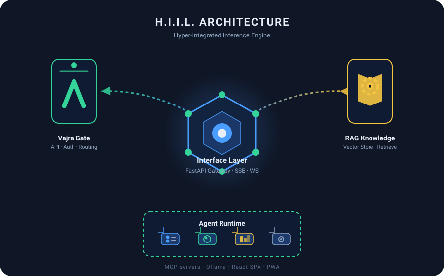
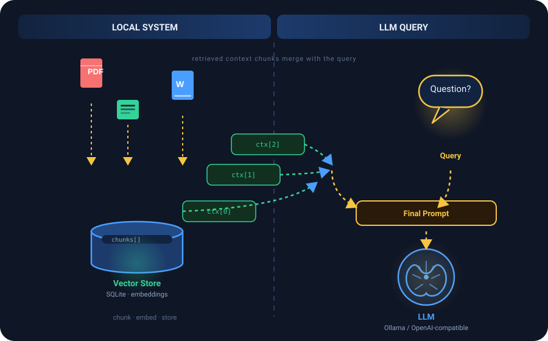
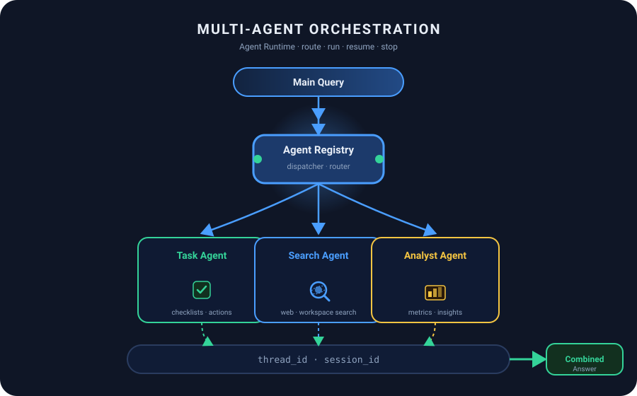

# H.I.I.L. — Hyper-Integrated Inference Engine

[](https://github.com/RAJA-432/hiil/actions/workflows/ci.yml)
[](#)
[](#)

> An extensible CLI and Web chat platform powered by MCP (Model Context Protocol) tool servers and Ollama — with built-in document RAG, multimodal vision processing, a persona/skills system, and an agent runtime served by a FastAPI gateway with an SSE-streaming React 19 UI.

```
CLI / React SPA ──▶ FastAPI gateway ──▶ mcp_cli (chat · RAG · agents) ──▶ Ollama + MCP servers
```

## Table of Contents

- [Preview](#preview)
- [Features](#features)
- [Tech Stack](#tech-stack)
- [Quick Start](#quick-start)
- [Usage Example](#usage-example)
- [Configuration](#configuration)
- [Vision & Image Input](#vision--image-input)
- [API](#api)
- [Built-in MCP Tools](#built-in-mcp-tools-veda_engine)
- [Project Layout](#project-layout)
- [Frontend](#frontend)
- [Testing & Quality](#testing--quality)
- [Contributing](#contributing)
- [License](#license)

## Preview

**Core architecture** — the Interface Layer hub radiating to Vajra Gate (API), RAG Knowledge, and the Agent Runtime:



**How RAG context is built** — documents chunked and embedded into the local vector store, with retrieved context merging into the LLM prompt:



**Multi-agent orchestration** — queries routed by the Agent Registry to specialized agents, all bound by a shared thread/session:



Add a screenshot or demo GIF of the running React SPA (served at `/canvas`) and the CLI into `docs/assets/demo.gif` to round out the preview.

## Features

- **Multimodal chat** — paste/drag-drop images; vision models (e.g. `gemma4:31b-cloud`) get them directly, text-only models get an OCR fallback. Vision capability is detected at runtime from Ollama's `/api/tags`, not guessed from the model name.
- **RAG knowledge base** — upload PDF/DOCX/text, chunked + embedded into a local vector store, auto-retrieved as context.
- **Agent runtime** — create agents with roles/capabilities, route queries, run/resume/stop them; LangGraph-compatible `/threads` + `/runs` API; A2A agent registry and message inbox.
- **Skills (personas)** — 6 bundled personas with prompt templates and per-skill MCP tool presets.
- **MCP native** — load any stdio MCP server (filesystem, memory, everything, custom) plus built-in `veda_engine` tools; browser-based connectors panel.
- **Full chat UX** — SSE streaming, inline edit/retry/undo, conversation search, tags, pinning, session history, token-usage bar, export to Markdown/JSON, inline SVG charts.
- **Secure by default** — rate limiting, trusted-host + CORS allow-lists, path-traversal-guarded file access, SSRF-protected web fetch, optional web-UI auth.
- **PWA frontend** — installable React 19 SPA with service worker; mock data layer for UI development without a backend.

## Tech Stack

| Layer | Tech |
|-------|------|
| Backend | Python 3.13/3.14, FastAPI, uvicorn, OpenAI SDK, httpx, tiktoken |
| LLM | Ollama (OpenAI-compatible `/v1`) or any OpenAI-compatible provider |
| RAG | Custom chunker + vector store (SQLite) |
| Frontend | React 19, Vite 6, Vitest, Monaco Editor |
| Tooling | Ruff, mypy, pytest, uv, GitHub Actions (Python 3.13 + 3.14) |

## Quick Start

### Windows (PowerShell)

```powershell
.\setup.ps1              # install deps, build frontend, serve at :8000
.\setup.ps1 -Dev         # Vite hot-reload dev server at :5173
```

### macOS / Linux (uv)

```bash
uv venv && source .venv/bin/activate
uv pip install -e ".[ocr]"   # drop the ".[ocr]" extra if you don't need OCR
python main.py               # CLI mode
```

### Docker

```bash
docker compose up --build
```

- Open <http://localhost:8000> (frontend is served from `/canvas`).
- CLI mode: `python main.py`.

`config.yaml` selects the provider/model. The default is `gemma4:31b-cloud` on Ollama (`http://localhost:11434/v1`).

### Requirements

- Python 3.11+ (CI runs 3.13/3.14)
- Node 18+ for the frontend
- Ollama running locally (or point `settings.base_url` at any OpenAI-compatible API)

## Usage Example

Send a chat message to the gateway (JSON):

```bash
curl -s -X POST http://localhost:8000/api/chat \
  -H "Content-Type: application/json" \
  -d '{"message": "Summarize the workspace", "session_id": "default"}'
```

Stream the reply over SSE (frontend uses this path):

```bash
curl -sN -X POST "http://localhost:8000/api/chat?stream=1" \
  -H "Content-Type: application/json" \
  -H "Accept: text/event-stream" \
  -d '{"message": "List the available MCP tools"}'
```

Call an MCP tool directly:

```bash
curl -s -X POST http://localhost:8000/api/tools/call \
  -H "Content-Type: application/json" \
  -d '{"name": "list_roots", "arguments": {}}'
```

## Configuration

Edit `config.yaml` for provider, model, MCP servers, and allowed root dirs. API keys via `hiil key set <provider> <key>` or the `MODEL_API_KEY` env var.

| Env var | Default | Description |
|---------|---------|-------------|
| `HIIL_WEBUI_USERNAME` / `HIIL_WEBUI_PASSWORD` | — | Enable web-UI auth (register/login). |
| `MODEL_API_KEY` | — | Provider API key (overrides `settings.api_key`). |
| `OLLAMA_HOST` | `http://localhost:11434` | Ollama server URL. |
| `VAJRA_GATE_CHAT_LOG` | `""` | Append SSE event JSON for every chat turn (one event/line). |
| `HIIL_LOG_LEVEL` | `info` | Log level. |
| `CORS_ORIGINS` | `http://localhost:8000,http://127.0.0.1:8000,http://localhost:5173` | Allowed CORS origins. |
| `ALLOWED_HOSTS` | `localhost,127.0.0.1,testserver,testclient` | Trusted host allow-list. |

## Vision & Image Input

- **Direct multimodal** — images are sent to the model as OpenAI-style `image_url` content blocks. Vision capability is resolved at runtime: Ollama models are matched against `/api/tags` capabilities; other providers fall back to a name heuristic.
- **OCR fallback** — text-only models get image text extracted instead. Requires `pip install -e ".[ocr]"` (Pillow + pytesseract) and the Tesseract binary:
  - Windows: `winget install UB-Mannheim.TesseractOCR` (or `choco install tesseract`)
  - macOS: `brew install tesseract` · Linux: `apt install tesseract-ocr`
- Without OCR, images to text-only models are gracefully skipped (warning logged).

## API

Interactive docs at <http://localhost:8000/docs>.

| Group | Endpoints |
|-------|-----------|
| Chat | `POST /api/chat` (JSON or SSE), `GET /api/models`, `POST /api/model`, `GET /api/status`, `GET /api/usage`, `GET /api/tools`, `POST /api/tools/call` |
| Auth | `POST /api/auth/register`, `POST /api/auth/login` |
| Sessions | `GET /api/sessions`, `GET /api/conversations`, `GET /api/history/{id}`, `POST /api/session/{new,switch,rename,delete}` |
| Agents | `POST/GET /api/agents`, `GET /api/agents/{id}`, `POST /api/agents/{id}/{route,run,resume,stop}` |
| Skills | `GET /api/skills`, `POST /api/skills/activate`, `GET /api/skills/output-schemas` |
| Knowledge | `POST /api/upload`, `GET /api/documents`, `GET /api/documents/{id}`, `POST /api/retrieve`, `GET /api/knowledge` |
| Files | `GET /api/files/{path}`, `GET /api/list`, `PUT/DELETE /api/files`, `POST /api/dirs`, `POST /api/files/rename` |
| Search | `GET /api/search` |
| Rewards | `POST/GET /api/rewards`, `GET /api/rewards/metrics` |
| LangGraph | `GET /ok`, `GET /info`, `/threads` CRUD, `POST /threads/{id}/runs[/stream|/wait]`, `/runs`, `/store`, `/store/items/query|search` |
| Runtime | `GET /health`, `GET /api/workspace`, `GET /metrics`, `/ws`, `/crons` CRUD, `/mcp/tools`, A2A `/a2a/agents` + `/a2a/messages` |

## Built-in MCP Tools (`veda_engine`)

- Workspace fileops — `read_text_resource`, `read_dir`, `search_resources`, `glob`, `grep` (path-traversal guarded)
- Documents — `read_document`, `edit_document` (stored-document CRUD)
- Web — `web_search`, `web_fetch` (DuckDuckGo + SSRF protection)
- `summarize` (delegates to LLM), `list_roots` (approved root dirs)

Default servers (from `config.yaml`): `veda_engine`, `@modelcontextprotocol/server-filesystem`, `-memory`, `-everything`, `setu_bridge.mock_mail`, `vajra_gate.tools.refiner`.

## Project Layout

```
hiil/
├── vajra_gate/          # FastAPI gateway — 12 routers, auth, middleware, crons, A2A, state
│   └── routers/         # chat, auth, sessions, agents, skills, files, knowledge, search,
│                        # rewards, langgraph, phase_c (crons/A2A/MCP), misc
├── mcp_cli/             # Core engine — CliChat, LLMClient, Streamer, ToolRunner, RAG,
│   └── services/        # vector store, context manager, history, usage, OCR, agents, ...
├── veda_engine/         # Built-in MCP server — workspace, documents, web, roots, summarize
├── setu_bridge/         # MCP client wrapper + mock_mail demo server
├── canvas_app/frontend/ # React SPA — chat, skills, preview, sidebar, toolbar, PWA
│   └── src/api/         # HTTP client + SSE + mocks/ (mock layer for backend-free dev)
├── config.yaml          # Provider, model, servers, roots
├── setup.ps1            # One-command setup
├── Dockerfile / docker-compose.yml
└── tests/               # 324 backend tests (pytest)
```

## Frontend

- React 19 + Vite 6 + Vitest 4; Monaco editor, react-markdown, custom markdown/chart/diff renderers.
- API layer is modular (`src/api/`) with a full mock layer (`src/api/mocks/`) — set `VITE_USE_MOCK=true` to develop the UI without a backend.
- PWA: installable, offline-ready via service worker (`sw.js`), icons + manifest.

```bash
cd canvas_app/frontend
npm run dev         # Vite dev server :5173
npm run build       # production build
npm test            # vitest — 21 tests
npm run lint        # eslint (0 warnings policy)
```

## Testing & Quality

Backend gates are enforced by CI on Python 3.13 and 3.14.

```bash
make test          # pytest tests/ -x -q         (324 tests)
make test-v        # verbose
make test-coverage # coverage report
make lint          # ruff check
make format        # ruff format --check
make typecheck     # mypy
make check         # lint + typecheck + test (what CI runs)
make generate-types# generate TypeScript types from OpenAPI schema
```

## Contributing

Contributions are welcome! See [CONTRIBUTING.md](CONTRIBUTING.md) for setup, branching, and commit conventions. This project follows the [Contributor Covenant](CODE_OF_CONDUCT.md). Report security issues via [SECURITY.md](SECURITY.md), and use the [issue templates](.github/ISSUE_TEMPLATE/) for bugs and feature requests.

## License

[MIT](LICENSE)
