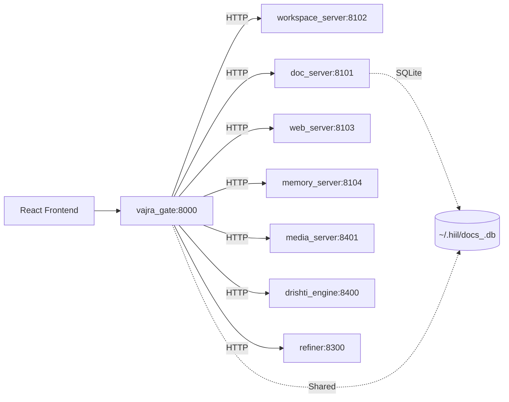

# Production Readiness Assessment Report

**Project:** H.I.I.L. – Hyper-Integrated Inference Engine  
**Date:** 2026-08-08  
**Review Type:** Senior Architect – Brutal Reality Check  
**Scope:** Full codebase (RAG, Agent Runtime, MCP Gateway, Vision, Multi-provider CLI)

---

## Executive Summary

The codebase demonstrates **high architectural ambition** but suffers from **prototype-level fragility**. It is **not production-ready** in its current state. The system has breadth (10+ integrated features) but lacks depth (stability, security hardening, operational maturity).

**Verdict:** Stop adding features. Consolidate, harden, and test the core value loop.

---

## Critical Findings

### 1. Feature Bloat – "Swiss Army Knife" Trap
- **Evidence:** RAG, Agent Runtime, MCP Gateway, Vision/OCR fallback, Multi-provider LLM, Custom CLI, File/Shell tools, Reward system, Phase-C workflows, Skills marketplace.
- **Risk:** Maintenance burden, hidden coupling, "80% done" syndrome across the board.
- **Impact:** No single feature is polished to production grade.

### 2. Fragile Gateway Architecture
- **Path:** React Frontend → FastAPI Gateway (`vajra_gate`) → MCP CLI (`mcp_cli`) → LLM Providers.
- **Risk:** 5+ network hops per request; serialization overhead; single-threaded CLI core in a multi-tenant web path; cascading failures.
- **Observation:** `mcp_cli` was designed for CLI use; embedding it in a web gateway is an architectural mismatch.

### 3. Security – "Hope-Based" Model
- **Surface:** LLM-driven shell execution (`veda_engine.tools.shell`), file read/write (`doc_server`), SSRF-prone web fetch (`web_server`).
- **Defenses:** Regex path guards, basic SSRF allow-list, no runtime sandboxing.
- **Risk:** A single prompt injection or model jailbreak → Remote Code Execution on the host.
- **Gap:** No container isolation (gVisor/Firecracker/Kata), no capability-dropping, no runtime anomaly detection.

### 4. RAG on SQLite – Scaling Ceiling
- **Implementation:** Local vector storage in SQLite (`hiil_common.storage.json_store` + `veda_engine.storage.store`).
- **Risk:** O(N) similarity search; no HNSW/IVF indexes; memory pressure at ~10k docs.
- **Gap:** No migration path to Milvus/Weaviate/Pinecone; no benchmark data.

### 5. Vision Pipeline Inconsistency
- **Dual Path:** VLM (when available) → rich understanding; Tesseract OCR fallback → noisy text extraction.
- **Risk:** Unpredictable UX; same image yields different answer quality depending on model availability.
- **Gap:** No unified confidence scoring or graceful degradation strategy.

---

## Strengths (Do Not Lose)

| Area | Why It Matters |
|------|----------------|
| **MCP-First Design** | Decouples tools from models; future-proofs against LLM vendor lock-in. |
| **Provider-Agnostic Core** | Swap Ollama ↔ OpenAI ↔ Anthropic ↔ local in minutes. |
| **Structured Agent Delegation** | `ToolRouter` + capability tags enable composable skills. |
| **Config-Driven Server Registry** | `config.yaml` + `server_manager` enables dynamic server discovery. |
| **Comprehensive Test Suite** | 800+ tests (793 passing) – strong regression net for the core. |

---

## Recommended Action Plan (Priority Order)

### P0 – Must Do Before Any Production Traffic
1. **Sandbox All MCP Servers**
   - Containerize each server (`workspace_server`, `doc_server`, `web_server`, `memory_server`, `media_server`, `drishti_engine`, `refiner`).
   - Drop capabilities: `CAP_SYS_ADMIN`, `CAP_NET_RAW`, etc.
   - Enforce read-only rootfs where possible; mount workspace as a dedicated volume.
2. **Collapse Gateway + CLI Core**
   - Embed MCP server logic directly into `vajra_gate` (or expose a thin HTTP shim).
   - Remove `mcp_cli` from the production request path.
3. **Freeze Feature Scope**
   - Define "Core" = RAG + Agent Runtime + Gateway + 3 MCP servers (doc, workspace, web).
   - Move everything else (media, drishti, reward, phase-c, skills) behind feature flags.

### P1 – Harden Core Within 2 Sprints
4. **Replace SQLite Vector Store**
   - Evaluate Milvus (standalone) or pgvector (if Postgres already used).
   - Add migration script + benchmark (target: <100ms p99 at 100k vectors).
5. **Unify Vision Pipeline**
   - Single VLM path with structured output schema.
   - Deprecate OCR fallback or isolate behind a `vision-fallback` service with explicit user consent.
6. **Add Runtime Security Monitoring**
   - Falco / Tetragon for syscall anomaly detection.
   - Audit log every tool invocation (user, tool, args hash, result hash).

### P2 – Operational Maturity
7. **Load & Chaos Testing**
   - Simulate 50 concurrent sessions; measure p99 latency, error rate, memory growth.
   - Inject failures: LLM timeout, tool crash, network partition.
8. **Observability Stack**
   - OpenTelemetry traces across gateway → MCP → LLM.
   - Structured JSON logs + Grafana dashboards (latency, token cost, tool success rate).
9. **CI/CD Gates**
   - Mandatory: `ruff`, `mypy`, full test suite, container image scan (Trivy), SAST (Bandit/Semgrep).

---

## Test Failure Baseline (Pre-Existing)

| Suite | Failures | Root Cause |
|-------|----------|------------|
| `test_agent_lifecycle` | 3 | Fixtures use `object.__new__(CliChat)` without `registry` |
| `test_chat_pipeline` | 10 | Fixtures missing `tool_runner` + `registry` |
| `test_route_classifier` | 2 | Fixtures missing both |
| `test_vision_pipeline` | 5 | Fixtures missing both |
| **Total** | **20** | **Gap 3 – test fixture debt** |

> **Note:** These 20 failures are **unrelated to the MCP server refactor** (verified against stashed baseline). They block CI green but do not affect production code paths.

---

## Appendix: Architecture Diagram (Logical)

---

## Sign-Off

| Role | Name | Status |
|------|------|--------|
| Senior Architect | (Automated Review) | ❌ **Not Ready** |
| Security Lead | – | ⏳ Pending sandbox proof |
| Platform Lead | – | ⏳ Pending gateway collapse |
| QA Lead | – | ⏳ Pending load test |

**Next Review Gate:** After P0 items 1–3 are implemented and validated.